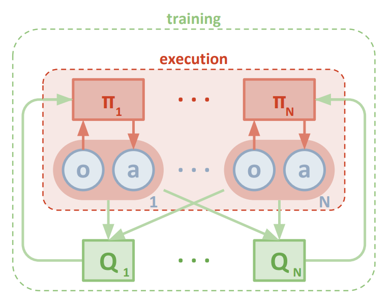

# Collaboration and Competition

## Project's goal

In this environment, two agents control rackets to bounce a ball over a net. If an agent hits the ball over the net, it receives a reward of +0.1.  If an agent lets a ball hit the ground or hits the ball out of bounds, it receives a reward of -0.01.  **Thus, the goal of each agent is to keep the ball in play.**

The task is episodic, and in order to solve the environment, **the agents must get an average score of +0.5 (over 100 consecutive episodes, after taking the maximum over both agents)**. Specifically,

- After each episode, we add up the rewards that each agent received (without discounting), to get a score for each agent. This yields 2 (potentially different) scores. We then take the maximum of these 2 scores.
- This yields a single **score** for each episode.

The environment is considered solved, when the average (over 100 episodes) of those **scores is at least +0.5.**


## Agent Implementation

This project uses an *off-policy method* called **Multi Agent Deep Deterministic Policy Gradient (MADDPG)** algorithm.

### Background for Deep Deterministic Policy Gradient (DDPG)

MADDPG find its origins in an *off-policy method* called **Deep Deterministic Policy Gradient (DDPG)** and described in the paper [Continuous control with deep reinforcement learning](https://arxiv.org/abs/1509.02971). 

> We adapt the ideas underlying the success of Deep Q-Learning to the continuous action domain. We present an actor-critic, model-free algorithm based on the deterministic policy gradient that can operate over continuous action spaces. Using the same learning algorithm, network architecture and hyper-parameters, our algorithm robustly solves more than 20 simulated physics tasks, including classic problems such as cartpole swing-up, dexterous manipulation, legged locomotion and car driving. Our algorithm is able to find policies whose performance is competitive with those found by a planning algorithm with full access to the dynamics of the domain and its derivatives. We further demonstrate that for many of the tasks the algorithm can learn policies end-to-end: directly from raw pixel inputs.

Deep Deterministic Policy Gradient (DDPG) is an algorithm which concurrently learns a Q-function and a policy. It uses off-policy data and the Bellman equation to learn the Q-function, and uses the Q-function to learn the policy.

More details available on the Open AI's [Spinning Up](https://spinningup.openai.com/en/latest/algorithms/ddpg.html) website.


This algorithm screenshot is taken from the [DDPG algorithm from the Spinning Up website](https://spinningup.openai.com/en/latest/algorithms/ddpg.html)

### Multi Agent Deep Deterministic Policy Gradient (MADDPG)

For this project I have used a variant of DDPG called **Multi Agent Deep Deterministic Policy Gradient (MADDPG)** which is  described in the paper [Multi-Agent Actor-Critic for Mixed Cooperative-Competitive Environments](https://arxiv.org/abs/1706.02275)

> We explore deep reinforcement learning methods for multi-agent domains. We begin by analyzing the difficulty of traditional algorithms in the multi-agent case: Q-learning is challenged by an inherent non-stationarity of the environment, while policy gradient suffers from a variance that increases as the number of agents grows. We then present an adaptation of actor-critic methods that considers action policies of other agents and is able to successfully learn policies that require complex multi-agent coordination. Additionally, we introduce a training regimen utilizing an ensemble of policies for each agent that leads to more robust multi-agent policies. We show the strength of our approach compared to existing methods in cooperative as well as competitive scenarios, where agent populations are able to discover various physical and informational coordination strategies.

 (screenshot from the paper)


The main concept behind this algorithm is summarized in this illustration taken from the paper :

 (screenshot from the paper)

> we accomplish our goal by adopting the framework of centralized training with
decentralized execution. Thus, we allow the policies to use extra information to ease training, so
long as this information is not used at test time. It is unnatural to do this with Q-learning, as the Q
function generally cannot contain different information at training and test time. Thus, we propose
a simple extension of actor-critic policy gradient methods where the critic is augmented with extra
information about the policies of other agents.

In short, this means that during the training, the Critics networks have access to the states and actions information of both agents, while the Actors networks have only access to the information corresponding to their local agent.

### Code implementation

The code used here is derived from the "DDPG pidedal" tutorial from the [Deep Reinforcement Learning Nanodegree](https://www.udacity.com/course/deep-reinforcement-learning-nanodegree--nd893), and modified to implement the **Multi-Agent Actor Critic**  as discussed in the Multi-Agent Udacity tutorial lesson.

The code is written in [Python 3.6](https://www.python.org/downloads/release/python-360/) and is relying on [PyTorch 0.4.0](https://pytorch.org/docs/0.4.0/) framework.

The code consist of :

- `model.py` : Implement the **Actor** and the **Critic** classes.
    - The Actor and Critic classes each implement a *Target* and a *Local* Neural Networks used for the training.

- `maddpg_agent.py`: Implement the MADDPG alorithm. 
  - The `maddpg` is relying on the `ddpg` class
   - It instanciates DDPG Agents
   - It provides a helper function to save the models checkpoints
   - It provides the `step()` and `act()` methods
   - As the **Multi-Agent Actor Critic** `learn()` function slightly differs from the DDPG one
   - The `learn()` method updates the policy and value parameters using given batch of experience tuples.
    
- Implement the **DDPG agent** and a **Replay Buffer memory** used by the DDPG agent.
    - The Actor's *Local* and *Target* neural networks, and the Critic's *Local* and *Target* neural networks are instanciated by the Agent's constructor
    - The `learn()` method is specific to DDPG and is not used in this project (I keep it for code later code reuse)
  

### MADDPG parameters and results

#### Methodology

As a starting point, I mainly used the vanilla DDPG architecture and parameters used in the previous Udacity project/Tutorials (Neural networks with 2 dense layers of size 400 and 300, Learning rate of 1e-4 for the Actors and 1e-3 for the Critics networks, discount factor of 0.99, tau with value 1e-3)

Then I tried to explore a few changes, which didn't work that well. Amongs these failed attemps, there were : 
- using gradient clippint during the critic optimization
- scaling the noise and using noise decay
- playing with the size of the neural networks (use smaller or larger ones)
- playing with the size of the replay buffer (smaller)
- trying Leaky Relu activation
- ...

But there were little modifications which helped the agents to converge a bit faster :
- Altering the Critics neural network so that the actions and states are concatenated directly at the input of the network (instead of concatenating the actions at the first hidden layer of the network, as in vanilla DDPG) 
- Use a use normal distribution to sample experiences from the Replay Buffer
- Adding Batch Normalization after the Activation in the first layers of the neural network helped to converge a bit faster (600 episodes less)
- A important change was to allow the agents to learn not at all episodes, and also be able to perform the learning process multiple times in a row. However too much updates, make the Agent learning very brittle at some point (critical forgetting)


Main "training millestones" :
- "First working version" : At first sight I thought the Agents were not learning, but they started to learn after ~3000 episodes, and were able to solve the environments in "4287 episodes with an Average Score of 0.50" 
- Change to "Learn 3 times in a row every 4 episodes" + Boost Critic Learning rate to 5e-3 and use a dicount factor of 0.995 : "Environment solved in 2989 episodes with an Average Score of 0.51" 
- Add Batch normalization : "Environment solved in 2487 episodes with an Average Score of 0.51"


#### MADDPG parameters

The final version of my MADDPG agents uses the following parameters values 

```
                 buffer_size=10000,
                 batch_size=256,
                 gamma=0.99,
                 update_every=2,
                 noise_start=1.0,
                 noise_decay=1.0,
                 t_stop_noise=30000

```
    

Both Neural Networks use the Adam optimizer with a learning rate of 1e-4 (actors) and 1e-3 (critics) are trained using a batch size of 200.

#### Results

Given the chosen architecture and parameters, our results are :


**These results meets the project's expectation as the agent is able to receive an average reward (over 100 episodes) of at least +0.5 in 2487 episodes** 


### Ideas for future work

- Change network sizes and choose different hyperparameters
- Trying other algorithms like PPO, A3C or D4PG
- Different replay buffer for actor/critic
- Try adding dropouts in critic network
- Add prioritized experience replay — This can improve learning by increasing the probability that rare or important experience vectors are sampled
